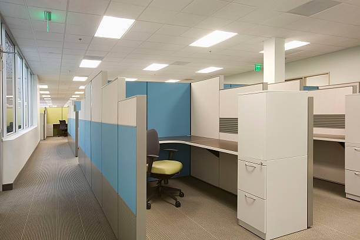

# What is a disk partition?
A partition is a part of a block device. Partitioning is a means of segmenting a **physical** device into multiple smaller
**logical** devices. If you think in terms of architecture, a partition is a temporary wall used to separate a large open space
into smaller individual spaces, such as cubicles.

## MBR partitioning scheme

## GPT partitioning scheme
